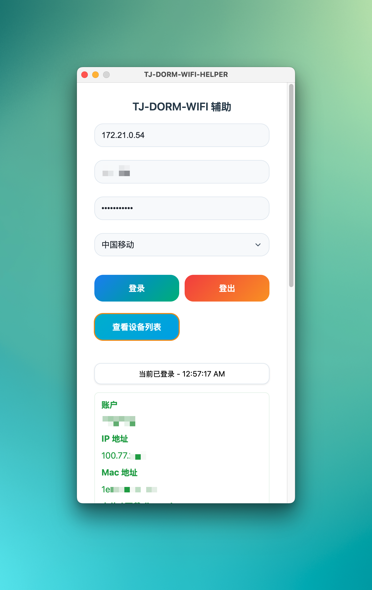

# TJ-DORM-WIFI-Helper Electron

基于 Electron 开发的同济天骄公寓校园网联网助手

支持 Win 和 Mac

# 演示



# 使用

## 直接下载

[Windows](https://github.com/sitdownkevin/TJ-DORM-WIFI-Helper/releases/download/1.0.2/TJ-DORM-WIFI-Helper.exe)

[macOS Arm](https://github.com/sitdownkevin/TJ-DORM-WIFI-Helper/releases/download/1.0.2/TJ-DORM-WIFI-Helper-arm64.dmg)

## 从源码构建

1. 安装需要的 package

```
npm install
```

2. 构建

```
npm build
```